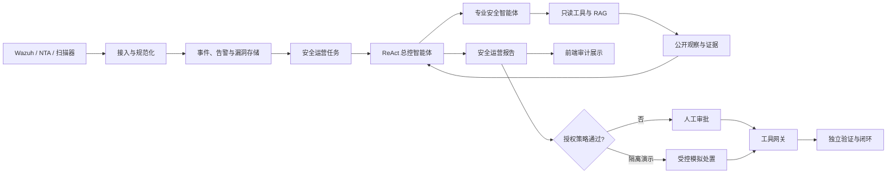

# ShieldChain

ShieldChain 是一个面向安全运营场景的多智能体分析与闭环原型。它接收 Wazuh、NTA 等安全数据，使用 DeepSeek API 完成受控规划和内容生成，并结合本地知识库、可审计工具调用与确定性安全策略，支持告警研判、误报治理、漏洞闭环和安全运营报告生成。

当前仓库是作品提交后的公开源码版本。它不包含模型权重、真实密钥、真实告警、运行数据库、服务器私有目录或已经从产品界面取消的旧功能代码。

## 核心能力

- **运营总览**：展示服务健康状态、当前调查运行、风险等级、证据数量和闭环结果。
- **实时告警**：接收并展示 Wazuh/NTA 告警，自动启动调查，支持人工标记误报、有效告警或证据不足。
- **漏洞排查与闭环**：完成“扫描发现—DeepSeek/RAG 研判—人工批准—修复登记—独立复测—关闭或退回”的审计流程。
- **安全运营报告**：按时间范围或告警运行生成中文报告，展示公开调查步骤、角色协作、工具回执、证据覆盖、处置边界和验证结果。
- **RAG 知识库**：支持文档导入、分块、混合检索、向量检索、重排、引用溯源、版本管理和依据不足时的安全降级。
- **智能助手**：结合知识库和历史调查结果回答安全问题，显示引用、文档版本、内容位置和完整性信息。
- **受控多智能体**：7 个安全运营角色在有限预算内进行 ReAct 观察、工具选择和角色交接。
- **可信工具边界**：模型只能从服务端白名单中选择工具；参数校验、授权、执行、回执和验证均由后端控制。
- **隔离演示闭环**：在明确标记的隔离 PCAP 回放和测试目标范围内，可演示自动授权、模拟处置与只读验证；普通真实目标不会复用该授权。

## 模型与安全边界

所有生成式模型调用统一通过 DeepSeek API。默认配置：

```dotenv
DEEPSEEK_BASE_URL=https://api.deepseek.com
DEEPSEEK_MODEL=deepseek-flash
DEEPSEEK_API_KEY=请填写自己的密钥
```

仓库只提供 `.env.example`，不会提交真实 `.env` 或 API Key。

模型负责分析和提出下一步计划，但不能绕过服务端规则。系统仅展示可审计的事实、证据、公开观察、角色交接、决策依据和执行回执，不保存或公开模型隐藏思维链、私有提示词、原始凭据及未经裁剪的敏感上下文。

## 系统架构



## 前端页面

| 页面 | 地址 | 作用 |
| --- | --- | --- |
| 主页 | `/` | 项目介绍和入口导航 |
| 运营总览 | `/dashboard` | 服务状态和当前调查摘要 |
| 实时告警 | `/alerts` | 告警接入、自动调查和误报治理 |
| 漏洞闭环 | `/vulnerabilities` | 漏洞研判、审批、修复登记和复测 |
| 安全运营报告 | `/operations-report` | 报告生成、多智能体协作、ReAct 轨迹和闭环审计 |
| 知识库 | `/knowledge` | 文档、版本、分块、索引和检索管理 |
| 智能助手 | `/assistant` | 带知识依据与历史调查上下文的安全问答 |
| 帮助 | `/help` | 使用说明和智能体角色介绍 |
| 关于 | `/about` | 项目定位 |
| 更新日志 | `/changelog` | 版本能力说明 |

`/response` 为兼容旧链接保留，会进入安全运营报告页面。智能体与 ReAct 轨迹已经整合到运营报告，不再提供独立工作台。

## 快速启动

### Docker Compose

要求：Docker Engine 及 Docker Compose v2。

```bash
cp .env.example .env
# 编辑 .env，至少填写 DEEPSEEK_API_KEY，并替换示例 Token
docker compose up --build -d
docker compose ps
```

浏览器访问：<http://127.0.0.1:8080>

健康检查：

```bash
curl http://127.0.0.1:8080/api/v1/health/ready
```

停止服务：

```bash
docker compose down
```

如需同时删除 Docker 数据卷，请在确认不再需要本地运行数据后执行 `docker compose down -v`。

### 前端开发

要求：Node.js 20+。

```bash
cd frontend
npm ci
npm run dev
```

常用验证命令：

```bash
npm run lint
npm run build
npm test -- --run
```

### 后端开发

要求：Python 3.12–3.14。

```bash
python -m venv .venv
source .venv/bin/activate
python -m pip install -e './backend[test]'
python -m uvicorn shieldchain.main:app --app-dir backend/src --reload
```

Windows PowerShell 使用 `.\.venv\Scripts\Activate.ps1` 激活虚拟环境。

## 主要目录

```text
backend/                 FastAPI 后端、迁移和测试
frontend/                React + TypeScript 前端
scripts/nta/             NTA 数据准备、检测与隔离回放脚本
scripts/server/          服务器启动和演示服务模板
scripts/wazuh/           Wazuh 集成脚本
sample_docs/             示例安全知识资料和评测集
tests/                   跨模块脚本测试与质量基线
docs/                    架构、运维、测试和交付文档
compose.yaml             本地 Docker Compose 入口
compose.server.yaml      服务器部署覆盖配置
```

## 数据接入与处置说明

- Wazuh Webhook、漏洞扫描器接入和演示回放分别使用独立 Token。
- 默认响应连接器模式为 `simulation`，不会直接操作生产防火墙或真实终端。
- 隔离回放只允许 RFC 5737 测试地址、演示 Agent 和允许名单文件。
- 真实环境接入必须补充正式 RBAC、密钥托管、双人审批、回滚、监控与审计策略。
- DeepSeek、RAG 或外部工具不可用时，系统应保留已确认事实并明确标注降级，不伪造检测、处置或验证结果。

## 验证状态

本次公开提交版已完成：

- 前端生产构建通过；
- ESLint 通过；
- 前端组件与接口测试 `107 passed`；
- Python 源码编译检查通过；
- 已退休的本地模型部署、模型管理器以及已取消独立页面的代码和引用检查为零；
- 常见 API Key、GitHub Token、云访问密钥和私钥头扫描无命中。

完整后端测试需要安装 `backend[test]` 依赖，并按测试说明准备相应服务或使用项目容器环境。

## 当前边界

ShieldChain 是可运行的比赛/科研原型，不是可直接替代企业 SOC、XDR、SIEM、EDR、漏洞扫描器或网络探针的商用平台。当前仍需补充长期真实数据集评估、生产级身份与权限、多租户隔离、密钥托管、容量测试、高可用、灾备和正式设备连接器。

## 提交与隐私

以下内容必须保持在 Git 之外：

- `.env`、API Key、Webhook Token、SSH 密钥；
- SQLite 数据库、真实告警、原始流量和模型权重；
- `.local/`、缓存、日志、构建产物和个人开发环境；
- 未经脱敏的比赛材料、客户数据或第三方受限资料。

提交前请再次检查 `git status`，并使用密钥扫描工具审计新增内容。
