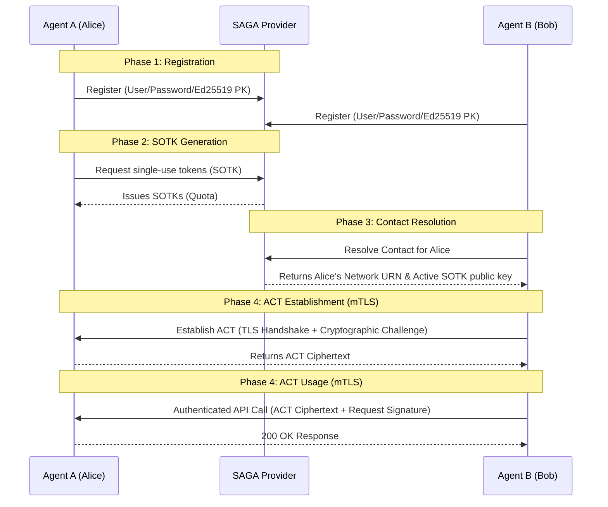

# SAGA: Security Architecture for Governing AI Agentic Systems

[English](README.md) | [中文](README_zh.md)

SAGA (Security Architecture for Governing AI Agentic Systems) is a framework designed to secure interactions between autonomous AI agents. This repository implements the core SAGA networking and cryptographic primitives, strictly following Domain-Driven Design (DDD) to guarantee robust, isolated, and auditable agent behavior.

## Core Features
1. **Agent Registration (Phase 1)**: Cryptographically verified onboarding of users and agents.
2. **Provider-Issued Single-Use Tokens (Phase 2)**: Scalable quota issuance via U-Prove/blind signatures (mocked as Ed25519 for demo) allowing privacy-preserving authentication.
3. **Contact Resolution (Phase 3)**: Secure discovery of target agents via a central Provider, preventing enumeration and ensuring access-control distribution.
4. **Agent-to-Agent Handshake (Phase 4)**: A novel U-Prove-backed ACT (Agent Contact Token) exchange that binds a network session securely to the resolved capability token, preventing MitM, replay, and token theft.
5. **Secure mTLS Network Layer (Phase 5)**: Complete FastAPI and Uvicorn integration enforcing X.509 `Subject Alternative Name` bindings over TLS 1.3 to authenticate the agents directly at the network transport layer.

## Architecture



## Quickstart

SAGA is designed with a real multi-agent deployment in mind. We provide standalone scripts to boot up the ecosystem locally using standard Python TLS sockets.

### 1. Requirements
- Python 3.10+
- `cryptography`, `fastapi`, `uvicorn`, `httpx`, `pydantic`

### 2. Generate the Test Public Key Infrastructure (PKI)
Before running the system, generate the local Certificate Authority and the Agent X.509 Certificates.
```bash
python scripts/create_test_ca.py --out tests/fixtures/pki
```
This will populate the `tests/fixtures/pki` directory with properly encoded `SERVER_AUTH` and `CLIENT_AUTH` certificates, populated with SAGA URNs (`urn:saga:agent:owner:name`).

### 3. Start the Provider
The central directory.
```bash
python scripts/run_provider.py --port 8000
```
*Accessible at `https://localhost:8000`*

### 4. Start Agent Servers
You can boot arbitrary agent instances mimicking different users. By default, mTLS is **strictly enforced**.
```bash
# Terminal 2 - Start Alice
python scripts/run_agent.py --port 8001 --owner alice --name agent-a

# Terminal 3 - Start Bob
python scripts/run_agent.py --port 8002 --owner bob --name agent-b
```

## Development and Testing
All protocols have strict boundary tests and network simulations.
```bash
# Run unit tests
python -m pytest tests/unit/ -v

# Run the full network simulator (FastAPI -> Provider -> Handshake -> Execution)
python -m pytest tests/integration/test_network_protocol.py -v
```

## Dashboard
The SAGA Provider includes a Management Dashboard (built in React) for visual inspection of the multi-agent ecosystem.
```bash
cd frontend
npm run dev
```

---
*Note: This architecture is a reference implementation of the SAGA paper specifications. The cryptography relies on standardized PyCA algorithms and strict domain isolation.*
