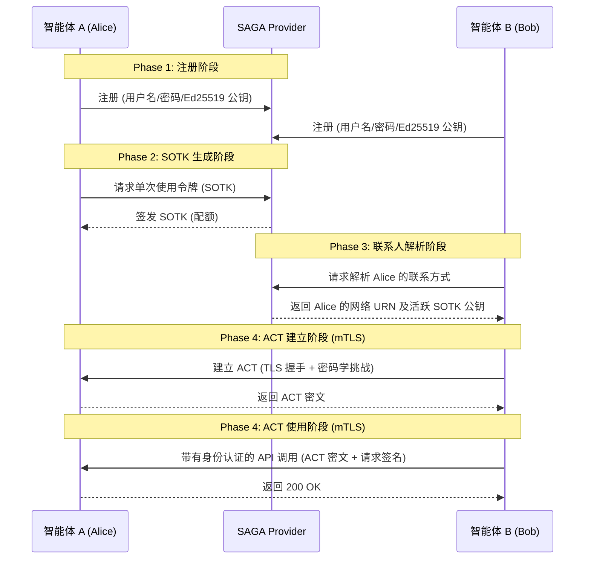

# SAGA: AI 智能体安全治理架构

[English](README.md) | [中文](README_zh.md)

SAGA (Security Architecture for Governing AI Agentic Systems) 是一个专为保障自主 AI 智能体间安全交互而设计的架构框架。本项目实现了 SAGA 核心的网络层与密码学原语，严格遵循领域驱动设计 (DDD)，旨在保证智能体行为的健壮性、隔离性与可审计性。

## 核心特性
1. **智能体注册 (Phase 1)**: 用户与智能体入网的密码学验证。
2. **Provider 签发的单次使用令牌 (Phase 2)**: 基于 U-Prove/盲签名的可扩展配额发放机制（在演示中采用 Ed25519 替代），从而实现隐私保护的身份认证。
3. **联系人解析 (Phase 3)**: 通过中央 Provider 安全地发现目标智能体，防止资源枚举探测，并确保访问控制策略的分发。
4. **智能体间握手 (Phase 4)**: 结合 U-Prove 机制的新型 ACT (Agent Contact Token) 交互流程。可将网络会话安全地与解析到的能力令牌绑定，防止中间人攻击、重放攻击与令牌窃取。
5. **安全的 mTLS 网络层 (Phase 5)**: 基于 FastAPI 与 Uvicorn 构建，并在 TLS 1.3 传输层严格执行基于 X.509 `Subject Alternative Name` (SAN) 的双向认证 (mTLS)。

## 架构概览



## 快速开始

SAGA 面向真实的多智能体部署环境设计。我们提供了一系列独立脚本，能够使用标准的 Python TLS Socket 在本地快速启动整个生态系统。

### 1. 环境依赖
- Python 3.10+
- `cryptography`, `fastapi`, `uvicorn`, `httpx`, `pydantic`
- Node.js (仅用于前端控制台)

### 2. 生成测试环境 PKI (公钥基础设施)
在运行系统前，需要生成本地的证书颁发机构 (CA) 以及智能体的 X.509 证书。
```bash
python scripts/create_test_ca.py --out tests/fixtures/pki
```
此命令将会在 `tests/fixtures/pki` 目录生成包含标准 `SERVER_AUTH` 与 `CLIENT_AUTH` 的证书，并内置 SAGA 专属 URN (`urn:saga:agent:owner:name`)。

### 3. 启动 Provider (控制中心)
启动负责全局注册与解析的中央 Provider：
```bash
python scripts/run_provider.py --port 8000
```
*服务运行在 `https://localhost:8000`*

### 4. 启动 Agent 服务器
你可以启动任意数量的智能体实例来模拟不同用户。默认情况下，系统**强制开启 mTLS 双向认证**。
```bash
# 终端 2 - 启动 Alice
python scripts/run_agent.py --port 8001 --owner alice --name agent-a

# 终端 3 - 启动 Bob
python scripts/run_agent.py --port 8002 --owner bob --name agent-b
```

## 开发与测试
所有协议均配备了严格的边界测试和网络模拟测试。
```bash
# 运行单元测试
python -m pytest tests/unit/ -v

# 运行全链路网络模拟测试 (FastAPI -> Provider -> 握手 -> 执行)
python -m pytest tests/integration/test_network_protocol.py -v
```

## Provider 可视化控制台
SAGA Provider 附带了一个现代化的 React 监控看板，用于直观地审查多智能体生态的运行状态。
```bash
cd frontend
npm install
npm run dev
```

---
*注：本架构是 SAGA 论文规范的参考实现。所有密码学实现均依赖于标准化的 PyCA 算法以及严格的领域模型隔离。*
