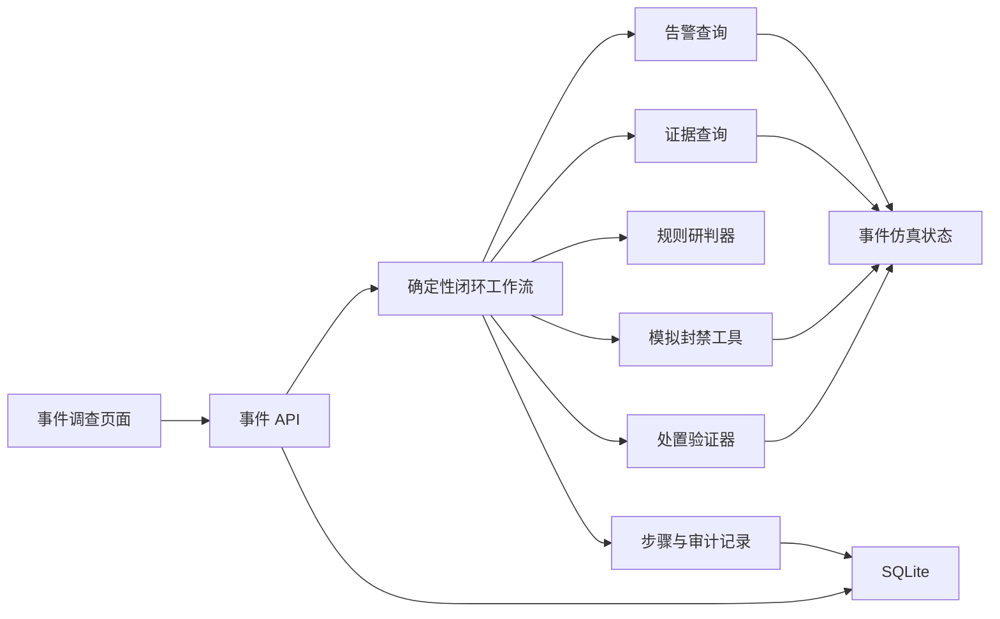
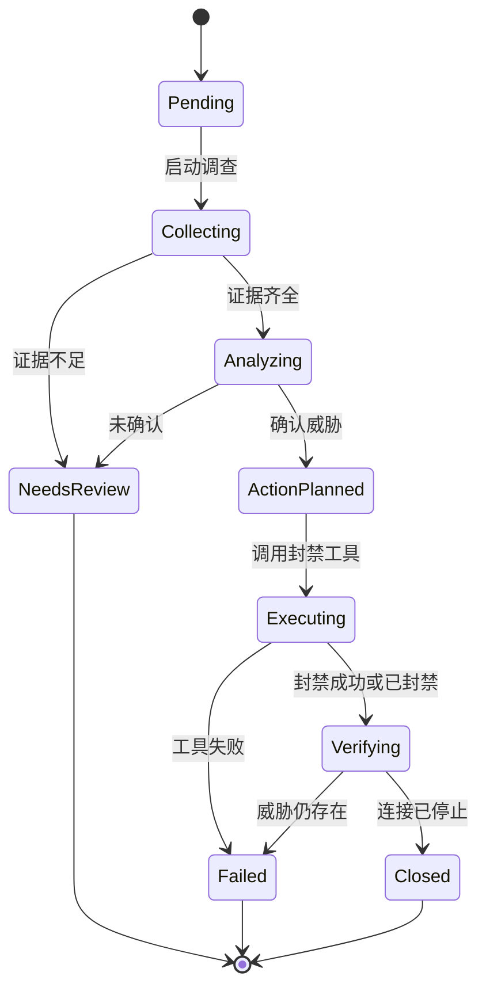

# 阶段二：钓鱼攻击仿真与最小事件处置闭环设计

> 文档状态：历史规划/设计归档。用于追溯阶段性决策，不代表当前运行方式；现行架构以 `docs/README.md` 及各目录现行文档为准。

## 1. 目标与范围

阶段二交付一个不依赖 LLM、可稳定复现和自动测试的最小安全事件闭环。用户从事件调查页面一键启动调查，系统依次接收告警、查询证据、执行确定性研判、模拟封禁恶意 IP、验证连接停止并关闭事件。

本阶段采用状态驱动的事件仿真器。安全工具读取或修改真实的仿真状态，不播放固定答案。默认场景稳定成功；非生产仿真模式支持“封禁失败一次”，用于证明工具失败时系统不会伪造成功。

本阶段只实现封禁恶意 IP。隔离终端、禁用账号、RAG、多智能体、可信工具网关、ReAct 重新规划及完整处置中心不在本阶段范围内。

## 2. 架构

系统由事件 API、确定性闭环工作流、仿真状态仓储、证据查询器、规则研判器、模拟封禁工具、验证器、审计存储和最小事件调查页面组成。

### 2.1 模块职责

- 事件仿真器：保存主机、账号、网络连接、告警、威胁情报和防火墙状态。
- 告警查询器：从仿真状态读取待调查告警，不修改状态。
- 证据查询器：查询终端进程、父进程、活动连接和威胁情报命中。
- 规则研判器：根据明确规则生成结构化结论，不调用 DeepSeek。
- 模拟封禁工具：以幂等方式修改防火墙和连接状态。
- 验证器：封禁后重新读取状态，确认恶意连接已经停止。
- 闭环工作流：通过显式状态机推进步骤，失败时安全终止。
- 审计存储：保存状态转换、证据引用、工具调用和失败原因。
- 事件页面：一键启动、轮询进度、显示证据和时间线、重置场景。

### 2.2 隔离原则

- 工作流依赖仿真端口，不直接操作仿真器内部数据结构。
- 后续真实防火墙适配器可替换模拟工具而不改变工作流。
- 后续多智能体研判可替换规则研判器而保持输入输出结构。
- 原始证据、研判结论、工具结果和审计事件采用不同模型。
- 阶段二不调用 DeepSeek，默认测试继续强制跳过真实付费调用。

## 3. 预置事件与证据

### 3.1 钓鱼攻击数据

- 事件：`INC-2026-0001`
- 告警：`ALT-2026-0001`
- 终端：`PC-023`
- 用户：`zhangsan`
- 源地址：`10.10.23.17`
- 恶意目标地址：`198.51.100.24`
- 目标端口：`443`
- 可疑进程：`powershell.exe`
- 父进程：`WINWORD.EXE`
- 命令摘要：执行经过脱敏的编码脚本
- 情报标签：`known-malicious-c2`
- 初始连接状态：`active`
- 初始防火墙状态：`not_blocked`

`198.51.100.0/24` 是文档示例地址范围，仿真数据不得引用真实攻击基础设施。页面必须显著显示“模拟环境”。

### 3.2 证据模型

证据包含证据 ID、类型、来源工具、观察时间、结构化摘要、原始数据引用、完整性哈希、可信度和确认状态。完整性采用键排序、紧凑分隔符的 canonical UTF-8 JSON；字段集合为 `evidence_type`、`source`、规范化 aware UTC `observed_at`、`summary`、`raw_reference`、`confidence`、`confirmed` 和完整 `payload`。SHA-256 摘要同时派生完整性值和确定性 UUID5 证据 ID。仓储写入、确定性规则和查询展示三个边界共用同一验证函数；查询返回服务端计算的 `integrity_verified`，无需迁移。阶段二至少产生：

1. 流量告警证据；
2. 终端进程证据；
3. 网络连接证据；
4. 威胁情报命中证据；
5. 防火墙执行结果；
6. 封禁后验证结果。

证据创建后不可更新。规则研判器只能引用证据，不能修改原始证据。

## 4. 确定性研判

同时满足以下条件时输出 `confirmed_threat`：

1. 告警状态为待调查；
2. 终端存在到目标 IP 的活动连接；
3. 目标 IP 命中仿真恶意情报；
4. 连接进程是 PowerShell；
5. PowerShell 的父进程是 Office 程序；
6. 证据之间不存在冲突。

研判输出包含结论、风险级别、命中规则编号、证据引用、推荐动作和可读说明。任何必要条件缺失时输出 `insufficient_evidence`，工作流进入 `needs_review`，不得执行封禁。

## 5. 工作流状态机

### 5.1 幂等与并发

- 同一事件已经关闭时，重复启动返回现有结果，不重复执行。
- 同一 IP 重复封禁返回 `already_blocked`，作为幂等成功。
- 每次工具调用使用唯一幂等键，并保存首次执行结果。
- 同一场景实例同一时间只允许一个活动运行。
- 场景重置恢复仿真状态并创建新运行记录，不删除历史审计。
- 活动运行期间拒绝重置。

## 6. API

- `POST /api/v1/simulations/phishing/reset`：重置场景并返回新实例。
- `POST /api/v1/investigations`：以场景实例 ID 和允许的演示模式启动调查，返回 `run_id`。
- `GET /api/v1/investigations/{run_id}`：返回运行状态、步骤、证据、研判、处置和验证。
- `GET /api/v1/incidents/{incident_id}`：返回事件详情和运行摘要。
- `GET /api/v1/incidents/{incident_id}/audit`：返回按时间排序的审计事件。

启动接口创建运行记录并启动短生命周期后台任务，不阻塞到闭环完成。前端每 500 毫秒轮询运行状态，直到 `closed`、`failed`、`needs_review` 或 `interrupted`。阶段二不引入 SSE、WebSocket、Celery、Redis或消息队列。

## 7. 页面交互

事件调查页面包含：

- 事件摘要：事件、终端、用户、恶意 IP、风险和状态；
- 控制区：启动调查、重置场景、非生产环境的“封禁失败一次”开关；
- 闭环时间线：告警、连接、进程、情报、研判、封禁、验证和关闭；
- 证据面板：来源、摘要、可信度和完整性标识；
- 处置面板：工具、目标、幂等键、执行结果和状态变化；
- 结果区：明确区分已闭环、证据不足、工具失败和运行中断。

运行期间禁止重复启动和重置。页面不展示隐藏思维链，只展示可验证的证据、规则、行动和结果。

## 8. 错误和安全边界

- 场景不存在：`404 simulation_not_found`。
- 事件正在运行：`409 investigation_already_running`。
- 非法状态转换：`409 invalid_investigation_state`。
- 证据不足：正常业务结果 `needs_review`，不是服务器错误。
- 工具失败：运行状态 `failed`，保留已有证据和审计。
- 前端轮询失败：显示连接异常并允许重试，不改变后端事件状态。
- 后端启动时把遗留活动运行标记为 `interrupted`，不得伪造成功。
- 活动运行存在时重置：`409`。
- 失败注入只允许在非生产环境；生产环境请求返回 `403`。

API 只接受预定义场景、枚举和后端 Schema。前端不能提交任意工具或命令。阶段二只注册 `block_ip` 仿真动作，不执行 Shell、脚本或用户提供的代码。审计只保存参数摘要，不保存密钥。

## 9. 持久化

阶段二新增：

- `simulation_instances`
- `incidents`
- `investigation_runs`
- `investigation_steps`
- `evidence_records`
- `simulation_tool_calls`
- `audit_events`

ID 使用 UUID。时间以 UTC 存储。证据只能追加。同一幂等键只能对应一次工具结果。同一场景实例最多一个活动运行。状态转换与审计在同一事务提交；仿真状态变化与工具结果在同一事务提交。数据库结构通过 Alembic 正式迁移创建，不在应用启动时临时建表。

## 10. 后台执行与恢复

- API 创建运行记录后启动受控的进程内后台任务。
- 每一步完成后立即持久化。
- 应用关闭时停止接收新任务。
- 用户批准的可靠性修订：一个有序公开领域常量定义全部数据库活动状态 `pending`、`collecting`、`analyzing`、`action_planned`、`executing`、`verifying`，活动判断、部分唯一索引、冲突查询和启动恢复均由它派生。应用启动时将这六态遗留运行标记为 `interrupted`，释放活动索引并允许安全 reset/start。
- 未来可替换为持久化任务队列，但不改变工作流端口和 API 模型。

## 11. 测试

### 11.1 领域与仿真单元测试

- 合法和非法状态转换；
- 规则命中、证据不足和风险等级；
- 证据不可变；
- 初始状态和只读查询；
- 封禁修改状态；
- 重复封禁幂等；
- 失败一次不修改防火墙或连接状态；
- 重置恢复初始状态。

### 11.2 工作流和 API 测试

- 正常闭环；
- 证据不足；
- 封禁失败；
- 重复启动；
- 重启后中断恢复；
- 状态变化对应审计；
- 重置、启动、查询和审计接口；
- 404、403、409 和非法参数；
- 并发启动限制。

### 11.3 前端测试

- 一键启动和 500 毫秒轮询；
- 时间线更新；
- 成功、证据不足、失败和中断；
- 重置与运行期间禁用；
- 轮询断线和重试；
- 模拟环境标识。

### 11.4 Windows 端到端冒烟

启动前后端，重置场景，从前端源站启动调查，等待 `closed`，验证连接从 `active` 变为 `blocked`，验证审计完整，然后清理进程和测试数据库。默认测试不得调用真实 DeepSeek。

## 12. 完成标准

- Windows 本机页面可一键执行完整的钓鱼事件闭环。
- 默认场景稳定达到 `closed`。
- 封禁真实改变仿真防火墙和连接状态，不仅改变页面文字。
- 重复封禁幂等。
- 工具失败明确失败，不生成虚假成功。
- 证据不足不执行封禁。
- 每一步有结构化审计和请求 ID。
- 后端重启不把未完成任务标记成功。
- 前后端、迁移、PowerShell 合约和端到端冒烟通过。
- 文档和开发日志同步更新。
- 阶段二使用独立分支和独立 PR，不重写阶段一提交历史。
